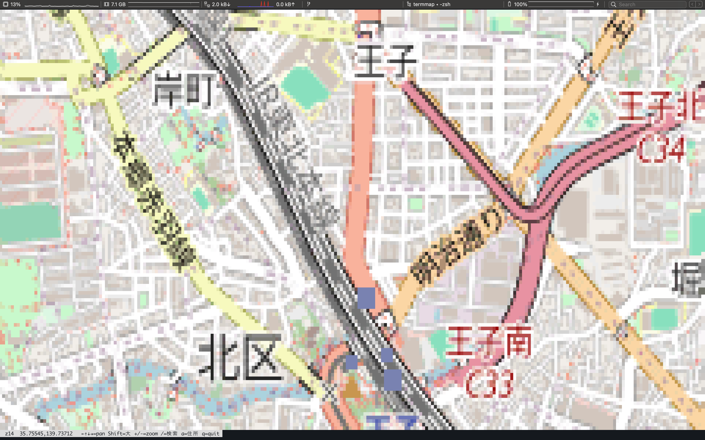
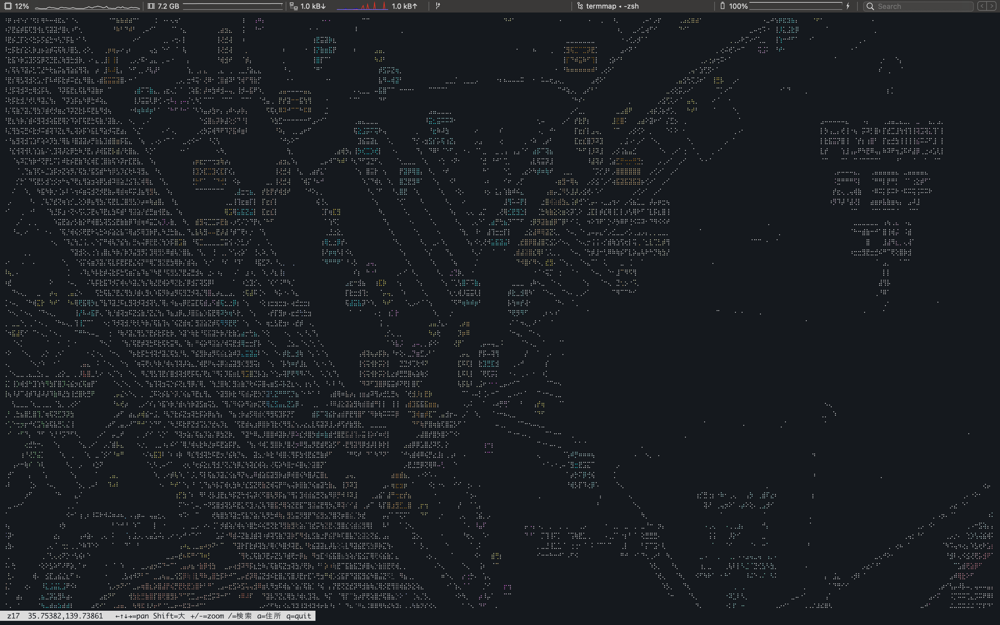

# termmap

OSM ラスタタイルを端末に描画する mapscii 風レンダラ。POI/ルート/航続リングを重畳するツーリング計画機能つき。

## screenshots

## build

    cargo build --release

バイナリ: `target/release/termmap`

## usage

    termmap --place "住所"  [options]
    termmap --lat LAT --lon LON  [options]
    termmap --here | --resume  [options]
    termmap --image PNG  [options]

## options

### 中心の指定
    --place STR     住所/地名をジオコーディング(Nominatim)して中心にする
    --lat LAT       中心の緯度
    --lon LON       中心の経度
    --resume        前回終了時の位置/ズーム/style/ルートを復元 (--last 同義)
    --here          GPS/測位で現在地を中心にする (要 CoreLocationCLI + 位置情報許可)

### 表示
    --zoom Z        ズーム 0..=20 (既定 14)
    --style NAME    タイル種別 osm|light|dark|voyager (既定 osm)。light/dark/voyager はラベル無し
    -i, --interactive   対話モード (下記キー参照)
    --braille       点字ドットで描画
    --mono          色なし (braille をプレーンテキスト化)
    --classify      地物カテゴリ色分け (水域/緑地/幹線道路/線路/建物)
    --edge          輪郭抽出 (道路/建物/川の境界を線画化)。clean な --style と併用
    --width N       出力桁数 (既定=端末幅)
    --threshold T   braille/edge の閾値 (braille 既定 195, edge 既定 45)

### ツーリング (重畳)
    --range KM,..   航続距離リング(複数可)。中心 or --home 基準
    --home LAT,LON  リングの基準点 (省略時は地図中心)
    --route "LAT,LON;LAT,LON[;..]"  ルート(始点;経由;終点)を BRouter で計算し重畳
    --route-mode M  surface(下道/高速回避) | highway(高速OK) | short(最短)。既定 surface
    --gpx OUT       ルートを GPX 書き出し
    --save-route N  現在の --route を名前 N でお気に入り保存
    --load-route N  お気に入り N を読み込む(始点を中心に)
    --routes        お気に入り一覧を表示
    --share         ルートをGoogleマップ経路URL+端末QRで出力(スマホで開く)

### 出力
    --png OUT       カテゴリ色の PNG を書き出して終了
    --image PNG     既存 PNG を描画 (タイル取得なし)

## interactive (-i) キー

    移動   ←↑↓→ パン / Shift+矢印 大きく / + - ズーム
    場所   / 住所・地名で検索して移動 / a 中心の住所
    ルート点   s 始点 / e 終点 / v 経由点(終点手前に追加) を中心クロスヘアに置く
    編集   Tab / Shift+Tab 点を選択(白丸で強調) / [ ] 選択点を前後へ並替 / x 選択点を削除
    設定   m モード(下道→高速→最短) / c ルート消去 / g GPX保存
    目的地 f カテゴリ検索(1-7)→左袖リスト(↑↓ / s 始点 / Enter 経由 / e 終点 / f 再検索 / Esc 閉)
    お気に入り  S ルート保存(名前入力) / L 呼び出し一覧
    終了   q  (Esc はサブモードの取消)

- 目的地カテゴリ: 1ガソスタ 2カフェ 3コンビニ 4道の駅 5展望 6公園 7峠道
- 検索した地点を経由にしたいときは / で移動してから s/e/v で置く
- ルートの下道=BRouter moped(高速回避) / 高速=car-fast / 最短=shortest。高速時は料金概算(高速km×¥30, 普通車概算)を表示

## examples

    termmap --place "東京都北区田端" --zoom 15 --classify
    termmap --place "王子駅" --zoom 16 --edge --mono --style voyager --width 92
    termmap --place "王子駅" -i --style voyager
    termmap --resume -i
    termmap --lat 35.75 --lon 139.74 --range 20,40 --png out.png
    termmap --route "35.737,139.760;35.659,139.773" --route-mode surface --gpx ride.gpx
    termmap --load-route 台場 -i

## notes

- タイル: `tile.openstreetmap.org` (© OpenStreetMap contributors, ODbL)
- ジオコーディング/逆ジオコーディング/語検索: Nominatim
- ルーティング: BRouter (公開API)。POI: Overpass API
- --here は CoreLocationCLI (`brew install corelocationcli`) 経由。初回は位置情報の許可が必要
- 料金は概算(高速区間 × ¥30/km, 普通車, 割引なし)。実額とは異なる
- お気に入りルート: `~/.config/termmap/routes/<名前>.txt`
