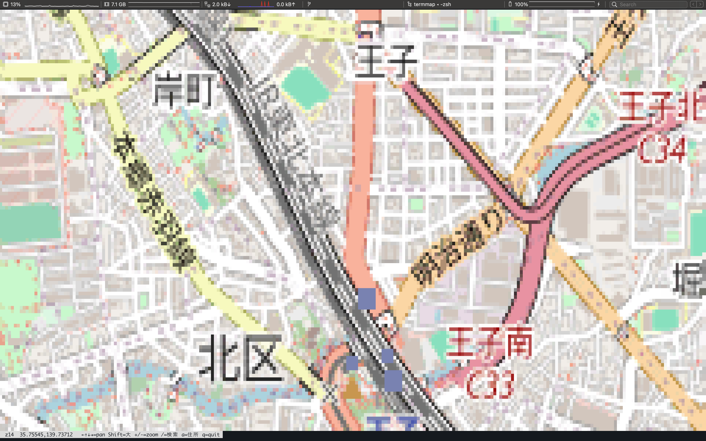
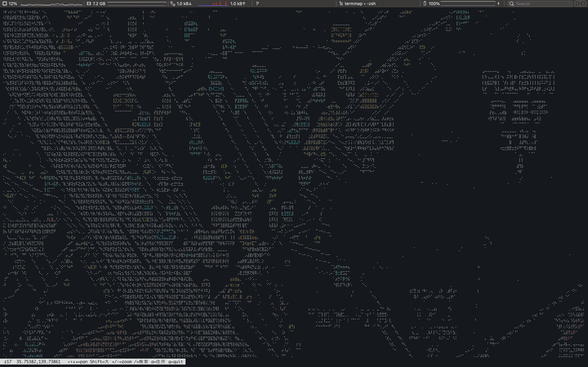

OSMラスタタイルを端末にhalfblock/braille/実画像で描画し、POI・ルート・航続リング・マイスポットを重畳するツーリング計画ツール。地名検索・ルート作成・目的地検索・お気に入り管理をすべて対話モード(キー操作)で完結できる。macOSを主眼に開発されているが、地図描画やルート計算など主要機能はLinux(x86_64)でも動作確認済み。macOS限定なのはライブ現在地取得(`--here`、CoreLocationCLI依存)のみ。

## screenshots




対話モードの操作イメージ(地点を置く→モード切替→並べ替え→目的地検索→ヘルプ)。


## 対応OS

macOS 想定。GPS連携(`--here`・ライブ現在地)は CoreLocationCLI 依存のため macOS 限定。地図描画・ルート計算・検索は他OSでも動く可能性はあるが未検証。

Linux(x86_64)は `--target x86_64-unknown-linux-musl` でのクロスコンパイルと動作(`--help`・`--place`+PNG出力)を確認済み。追加の依存修正は不要だった。

## インストール

    cargo build --release

バイナリ: `target/release/termmap`

## 使い方

    termmap                      引数なし=前回位置から対話起動(保存が無ければ東京中心)
    termmap --place "住所"  [options]
    termmap --lat LAT --lon LON  [options]
    termmap --here | --resume  [options]
    termmap --image PNG  [options]

引数なしの `termmap` で前回終了時の位置から対話モードが立ち上がり、キー操作で地図を動かしながらルート・目的地・お気に入りを組み立てられる。前回の保存が無ければ東京中心で開く。

    termmap                   前回位置(なければ東京)で対話起動
    termmap --place "東京駅"    場所を指定して対話起動

`-i` / `--interactive` は対話が既定になる前からの後方互換エイリアス。付けても付けなくても対話で起動する。

## 主要機能

- **地名・住所検索**: Google Geocoding(APIキー設定時・優先)→ Nominatim の順にフォールバック。番地まで含めて0件のときは大字/町名レベルに丸めて再検索する
- **検索結果キャッシュ**: キーワード+位置をキーにした結果をローカルに保存し、同条件の再検索はAPIを叩かない
- **周辺キーワード検索**: 表示中の範囲内で施設名/ブランド名を Overpass で部分一致検索(例: 「セブン」でセブン-イレブンも拾う)
- **目的地カテゴリ検索**: ガソスタ/カフェ/コンビニ/道の駅/展望/公園/峠道の7カテゴリをワンキーで検索
- **ルート作成**: 中心クロスヘアに地点を置く(並び順で始点→…→終点が自動)、並べ替えパネル(左袖)での組み立て、道路名/refでの経路追加(複数連結可)、代替ルート候補の巡回
- **走りまくり**: 現在地から峠・展望スポットを巡る周回(または片道)ルートを自動生成
- **お気に入りルート**: 名前を付けて保存/呼び出し、一覧表示
- **マイスポット**: カテゴリ階層(登録・改名・並べ替え・色分け)で任意の地点を保存。GoogleマップURLを貼るだけで座標+店名を抽出登録できる
- **標高プロファイル・ルート再生・ライブ現在地**: 確定ルートの高低差表示、プレビュー走行アニメ、CoreLocationCLI経由の現在地トラッキング
- **実写(Street View)**: 中心地点の実写を全画面表示(要 Google APIキー)
- **雨雲レーダー**: 気象庁ナウキャストの降水を地図に半透明で重ねる(`C`)。`<` `>` で表示時刻を過去〜未来へ動かせる(直近60分は5分刻み、それより先は降水短時間予報で最大+15時間まで1時間刻み)ので、走る前に雨雲の抜けるタイミングを見られる
- **ルート音声案内**: 設定画面でONにすると、確定ルートの曲がり角へ300m手前/直前の2段階で読み上げ案内する(BRouterのturnInstructionModeから取得)。実行環境がmacOSローカルならsayコマンド、web(ttyd)経由ならブラウザのWeb Speech APIで読み上げる。macOS側の声は設定画面の「読み上げの声」で選べる(インストール済みの日本語音声から一覧選択・試聴可)
- **通行止めの回避**: 設定画面で「通行規制」をONにすると、実施中の通行止め(国交省road-info-prvs)をBRouterのルート計算でも避けるようになる(`T`キーで規制原因等の詳細表示)。原因が判明した区間には事故✕(赤)/工事(黄)のアイコンも重ね描きする
- **渋滞状況の色分け**: 設定画面で「渋滞状況の色分け」をONにすると、ルート確定のたびにGoogle Directionsで区間ごとの渋滞状況を追加確認し、混雑している区間だけルート線を黄(やや混雑)/赤(混雑)で上塗りする(順調な区間は基調色の青のまま。要Google APIキー)
- **QR共有**: ルートをGoogleマップ経路URL化し、端末にQRコードを表示してスマホで開ける
- **2階層Spaceメニュー**: 全操作をキー無しでも選べる(カテゴリ→項目)。熟練者は各項目のキーを直打ちしてもよい
- **設定画面**: 描画スタイル・ルート既定・APIキー等を実行中に切り替え、`config.toml` へ保存できる

## config.toml

場所: `~/.config/termmap/config.toml`

```toml
[llm]
recommend_enabled = true
model = "claude-sonnet-5"
command = "claude"

[route]
profile = "car-fast"
sample_interval_m = 800.0
voice_guide_enabled = false

[display]
style = "osm"
show_spots = true
braille = false
classify = false
edge = false
mono = false

[google]
maps_api_key = ""

[streetview]
enabled = true

[radar]
enabled = false
opacity = "mid"
refresh_sec = 300
```

- `[google] maps_api_key`: 地名検索(Geocoding)と実写(Street View)で共通に使うキー。環境変数 `TERMMAP_GOOGLE_API_KEY` があればこちらを優先(configにキーを書かず運用できる)
- `[radar] enabled`: 起動時に雨雲レーダーをONにするか。既定 `false`(`C` を押した人だけが気象庁へ問い合わせる)
- `[radar] opacity`: 雨雲の濃さ `light`(0.35) / `mid`(0.55) / `strong`(0.75)
- `[radar] refresh_sec`: フレーム時刻一覧(targetTimes)の再取得間隔(秒)。既定300(ナウキャスト自体が5分更新なのでこれより短くしても新しい情報は無い)。設定画面には出さない。下限60秒
- `[route] voice_guide_enabled`: ルート音声案内(曲がり角の読み上げ)をONにするか。既定 `false`(ONにした人だけがBRouterへ曲がり角情報を追加問い合わせする)
- `[route] voice_name`: macOSの`say`に渡す音声名(読み上げの声)。既定 `"Kyoko"`。空文字にするとOS既定の声になる。設定画面から選ぶ方が確実(インストール済みの声だけが並ぶ)
- 旧スキーマ `[streetview] api_key` は後方互換で読める(`[google] maps_api_key` が空のときのみ採用)
- 未設定でも動く。地名検索は Nominatim のみに、実写は「APIキー未設定」表示になる

対話モードの設定画面(`,`)からも同じ項目を切り替えて保存できる。

## スマホのブラウザから使う (ttyd)

キーボードの無いスマホ(iPhone等)から、スワイプとタップだけで操作するための一式。
termmap 本体はそのままで、[ttyd](https://github.com/tsl0922/ttyd) の配信ページに
タッチ操作用のオーバーレイ(`web/touch-overlay.js`)を足して実現している。
認証は ttyd の Basic 認証ではなく、手前に置く小さな Cookie 認証プロキシ
(`src/bin/webauth-proxy.rs`)で行う。

    brew install ttyd

**1. ビルドとページ生成**(ページ生成は初回と ttyd 更新時だけでよい)

    cargo build --release
    scripts/build-web-index.sh

`build-web-index.sh` は ttyd の既定ページを取得し、viewport 指定とオーバーレイを
埋め込んだ `web/index.html` を書き出す(生成物なので git 管理外)。

**2. 起動**

    export TERMMAP_WEB_USER=好きなユーザー名
    export TERMMAP_WEB_PASS=十分に長いパスワード
    scripts/serve-web.sh

`127.0.0.1:7681` だけで待ち受ける。ログインが必須で、既定のユーザー名・パスワードは
用意していない(環境変数が未設定なら起動せずに終了する)。
`serve-web.sh` は ttyd(認証なし・`127.0.0.1:17681` の内部ポート)と、その手前の
`webauth-proxy`(公開ポート 7681)の2プロセスを起こす。Ctrl-C で両方止まる。

**3. 外から繋ぐ**(使う時だけ手で立ち上げる)

    cloudflared tunnel --url http://127.0.0.1:7681

表示された `https://....trycloudflare.com` をスマホで開くとログイン画面が出る。
`TERMMAP_WEB_USER` / `TERMMAP_WEB_PASS` を入れれば地図が出る(以降30日はCookieで素通り)。
使い終わったら `cloudflared` と `serve-web.sh` を両方止める。

### 認証(webauth-proxy)

ttyd の `-c`(Basic 認証)を使わないのは、iOS Safari が最初のページで通した資格情報を
裏で走る `/token` の fetch や WebSocket ハンドシェイクへ再利用せず、Cloudflare Tunnel 経由だと
認証が通らずリロードを繰り返すため。Cookie ならどちらにも自動で付くので、認証だけを
前段のプロキシに出した(設計: `docs/web-auth-proxy-design.md`)。

    ブラウザ ⇄ (HTTPS) Cloudflare Tunnel ⇄ webauth-proxy:7681 ⇄ ttyd:17681 ⇄ termmap

- `POST /login` の user/pass を環境変数と定数時間比較し、通れば 32byte 乱数のセッション
  トークンを `termmap_session` Cookie(HttpOnly / Secure / SameSite=Strict / 30日)で渡す
- Cookie が無い/期限切れ: 通常のページはログインフォーム、WebSocket は 401
- セッションはプロセス内メモリのみ。`serve-web.sh` を再起動したらログインし直し
- パスワードを間違えると1秒待たされる(簡易ブルートフォース対策)
- 変更したいときのつまみ: `TERMMAP_WEB_PORT`(公開・既定7681)、
  `TERMMAP_WEB_TTYD_PORT`(内部・既定17681)
- Cookie に `Secure` を付けているため、素の HTTP で直接開く場合はブラウザによっては
  ログイン状態が保持されない(Safari など)。トンネル越しの HTTPS が本来の使い方で、
  手元で直に触るならターミナルから termmap を起動すればよい

### タッチ操作

| 操作 | 動き |
|---|---|
| スワイプ | 地図をつかんで動かす(指の向きと逆に視点が動く。Googleマップと同じ)。払った距離が長いほど大きく動く。指を離した後も慣性で少し流れる |
| 2本指ピンチ | ズーム |
| タップ | Enter(中心付近の最寄りお気に入りにスナップ) |
| `Menu` | Space。メニューを開く(以降は `◀ ▶` ではなくスワイプの上下で項目移動、タップで決定) |
| `▲ / ▼` | 上下(メニューでは項目選択) |
| `⏎` | 決定(メニュー選択・検索実行等。タップと同じ) |
| `− / ＋` | ズーム |
| `☂` | 雨雲レーダー 表示/非表示 |
| `◀ / ▶` | 雨雲レーダーの表示時刻を前/後へ5分 |
| `Esc` | 戻る/取消 |
| `?` | ヘルプ(画面に収まらない分はページ送り。任意のキーで次ページへ進み、最終ページで閉じる) |
| `⌨` | ソフトキーボードを開く(住所検索・名前入力用)。開いている時にもう一度押すと閉じる |
| `📍` | スマホのGPSでライブ現在地(トグル)。Mac本体のGPS(`G`キー・CoreLocationCLI)とは別経路 |
| `☰` | ルート一覧(左袖)の表示/非表示(`R`キーと同じ。ルート自体は消えない) |

終了(`q`)のボタンは意図的に置いていない。誤タップでセッションごと落ちるほうが困るため、
離脱はブラウザのタブを閉じて行う。

文字入力が要る操作(住所検索 `/` やスポット名の入力など)はソフトキーボードが必要になるため、
このオーバーレイだけでは完結しない。

### 実画像モード(インライン画像)

`web/vendor/xterm-addon-image.js`(本家 `@xterm/addon-image`。`build-web-index.sh` が
埋め込む)により、ブラウザ側の xterm.js も iTerm2 のインライン画像(OSC 1337)を描画できる。
`scripts/serve-web.sh` は起動元のターミナルが何であっても `TERM_PROGRAM=iTerm.app` を
明示設定して termmap 側の `image_capable()` を真にする(`LC_TERMINAL` / `ITERM_SESSION_ID`
は渡さない)。実際に実画像で描くかは `cfg.image_mode`(既定OFF・`I`キーか設定画面で切替)側で決まる。

### 注意

- 縦持ちだと端末幅が約50桁しかなく、ステータス行の右側(座標など)が切れる。横持ちにすると収まる。

## 必要な外部依存

- 地図タイル: `tile.openstreetmap.org`(標準)、CARTO(voyager/dark/light)、OpenTopoMap(topo。地形陰影・等高線)
- 地名検索・逆ジオコーディング: Nominatim(無料・キー不要)
- 地名検索(優先): Google Geocoding API(任意・要APIキー)
- ルーティング: BRouter(公開API)
- 目的地・周辺検索: Overpass API
- 実写: Google Street View Static API(任意・要APIキー)
- 雨雲レーダー: 気象庁 降水ナウキャスト(直近60分)+降水短時間予報(60分〜15時間先。キー不要。どちらも開発者向けAPIとして公開されたものではない非公式エンドポイントの個人利用であり、予告なく停止しうる)
- GPS/現在地: CoreLocationCLI (`brew install corelocationcli`。macOSのみ、初回は位置情報の許可が必要)
- おすすめ機能: `claude` CLI (Claude Code。config.toml `[llm] command` で変更可)

## options

### 中心の指定
    --place STR     住所/地名を検索して中心にする(Google Geocoding優先→Nominatim)
    --lat LAT       中心の緯度
    --lon LON       中心の経度
    --resume        前回終了時の位置/ズーム/style/ルートを復元 (--last 同義)
    --here          GPS/測位で現在地を中心にする (要 CoreLocationCLI + 位置情報許可)

### 表示
    --zoom Z        ズーム 0..=20 (既定 14)
    --style NAME    タイル種別 osm|voyager|dark|light|topo (既定 osm)。voyager/dark/light はラベル無し、topoは地形陰影・等高線(OpenTopoMap)
    -i, --interactive   対話モードの後方互換エイリアス (対話は既定。下記キー参照・詳細は docs/MANUAL.md)
    --braille       点字ドットで描画
    --mono          色なし (braille をプレーンテキスト化)
    --classify      地物カテゴリ色分け (水域/緑地/幹線道路/線路/建物)
    --edge          輪郭抽出 (道路/建物/川の境界を線画化)。clean な --style と併用
    --width N       出力桁数 (既定=端末幅・1..=1024)
    --threshold T   braille/edge の閾値 (braille 既定 195, edge 既定 45)

### ツーリング (重畳)
    --range KM,..   航続距離リング(複数可)。中心 or --home 基準
    --home LAT,LON  リングの基準点 (省略時は地図中心)
    --route "LAT,LON;LAT,LON[;..]"  ルート(始点;経由;終点)を BRouter で計算し重畳
    --route-mode M  surface(下道/高速回避) | highway(高速OK) | short(最短)。既定 surface
    --gpx OUT       ルートを GPX 書き出し
    --save-route N  現在の --route を名前 N でお気に入り保存
    --load-route N  お気に入り N を読み込む(始点を中心に)
    --routes        お気に入り一覧を表示
    --share         ルートをGoogleマップ経路URL+端末QRで出力(スマホで開く)
    --wander        峠/展望を巡る周回(または片道)ルートを自動生成
    --dist KM       走りまくりの目安距離 (既定 40)
    --shape S       走りまくりの形状 loop(周回)|oneway(片道) (既定 loop)

### 出力
    --png OUT       カテゴリ色の PNG を書き出して終了
    --image PNG     既存 PNG を描画 (タイル取得なし・地理原点が無いため重畳は不可)

## interactive (-i) キー概要

キー全体・Spaceメニューの構造・各画面の詳細操作は `docs/MANUAL.md` を参照。

    移動   ←↑↓→ パン(既定は細かく・押し続けで加速/Shift+矢印で常に高速) / hjkl 矢印と同じ(大文字HJKLで常に高速) / + - ズーム / Space メニュー
    場所   / 住所・地名で検索して移動 / a 中心の住所
    ルート点   v 中心クロスヘアに地点を置く(並び順で始点→…→終点が自動)
    編集   Tab で並べ替えビューへ(地図のままw/sでも一覧を上下できる) / [ ] 選択点を前後へ並替 / x 選択点を削除
    ルート設定   m モード(下道→高速→最短) / c ルート消去(確認あり) / g GPX保存 / n 代替ルート / r 道路名で追加 / W 走りまくり / R 左袖の表示切替
    目的地 f カテゴリ検索(1-7)→左袖リスト(↑↓/ws選択 / v 追加 / Enter移動 / f 再検索 / Esc 閉)
    お気に入り  S 保存/呼び出しの小メニュー / P マイスポット
    表示・ナビ  E 標高プロファイル(高さ目盛り付き) / A ルート再生(実速度・[ ]で速度調整) / G ライブ現在地 / i 実写(+/-でズーム) / V スポット表示切替 / o QR共有
    雨雲   C 雨雲レーダー表示切替 / < > 表示時刻を過去・未来へ(直近60分は5分刻み、それより先は1時間刻みで最大+15時間)
    災害   B 中心に一番近い地点の過去災害の事例一覧(設定でONにすると、市区町村ごとの記録の多さで地図が塗り分けられる)
    設定   , 設定画面(braille/classify/edge/mono/style等。3択以上の項目はEnterでその場にアコーディオン展開。変更は自動保存)
    終了   ?  ヘルプ   q  終了   Esc  サブモード取消   Ctrl+C  通信中の処理を中断(終了はq)

- 目的地カテゴリ: 1ガソスタ 2カフェ 3コンビニ 4道の駅 5展望 6公園 7峠道
- ルートの下道=BRouter moped(高速回避) / 高速=car-fast / 最短=shortest。高速時は料金概算(高速km×¥30, 普通車概算)を表示
- 初回起動時は簡易オンボーディング(Space/?/qの案内)を表示。以後は出さない

## examples

    termmap
    termmap --place "東京都北区田端" --zoom 15 --classify
    termmap --place "王子駅" --zoom 16 --edge --mono --style voyager --width 92
    termmap --place "王子駅" -i --style voyager
    termmap --resume -i
    termmap --lat 35.75 --lon 139.74 --range 20,40 --png out.png
    termmap --route "35.737,139.760;35.659,139.773" --route-mode surface --gpx ride.gpx
    termmap --load-route 台場 -i
    termmap --home 35.68,139.76 --wander --dist 60 --shape loop -i

## トラブルシュート

- 検索が0件(「見つからない」)と通信・サーバ障害は区別される。通信障害時はメッセージにエラー内容が出る
- 実写(`i`)が「APIキー未設定」になる場合は `config.toml` の `[google] maps_api_key`(または環境変数 `TERMMAP_GOOGLE_API_KEY`)を設定する
- `--here` やライブ現在地(`G`)が動かない場合は `brew install corelocationcli` の有無と、システム設定 > プライバシーとセキュリティ > 位置情報サービスでの許可を確認する
- おすすめ(`@`)が使えない場合は `config.toml [llm] recommend_enabled` と `claude` CLI の有無を確認する
- 対話モード終了時の状態(位置/ズーム/style/ルート)は自動保存され、次回 `--resume` で復元できる

## notes

- タイル: `tile.openstreetmap.org` (© OpenStreetMap contributors, ODbL)、CARTO(voyager/dark/light)、OpenTopoMap(topo。© OpenTopoMap (CC-BY-SA))
- ジオコーディング/逆ジオコーディング/語検索: Nominatim。優先で Google Geocoding
- ルーティング: BRouter (公開API)。目的地・周辺検索: Overpass API
- 雨雲レーダー: 出典 気象庁ナウキャスト
- 過去災害の履歴: 出典 防災科学技術研究所 災害事例データベース / 市区町村境界 気象庁
- 料金は概算(高速区間 × ¥30/km, 普通車, 割引なし)。実額とは異なる
- お気に入りルート: `~/.config/termmap/routes/<名前>.txt`
- マイスポット: `~/.config/termmap/spots.txt` / カテゴリ: `~/.config/termmap/spot-categories.txt`
- 検索キャッシュ: `~/.config/termmap/search-cache.tsv`
- 地図タイルキャッシュ: `~/.config/termmap/tiles`(30日)
- 重ねるデータのキャッシュ: `~/.config/termmap/plot-cache`(交通量5分/規制10分/カメラ7日/主要道路30日/過去災害30日/市区町村境界180日)
