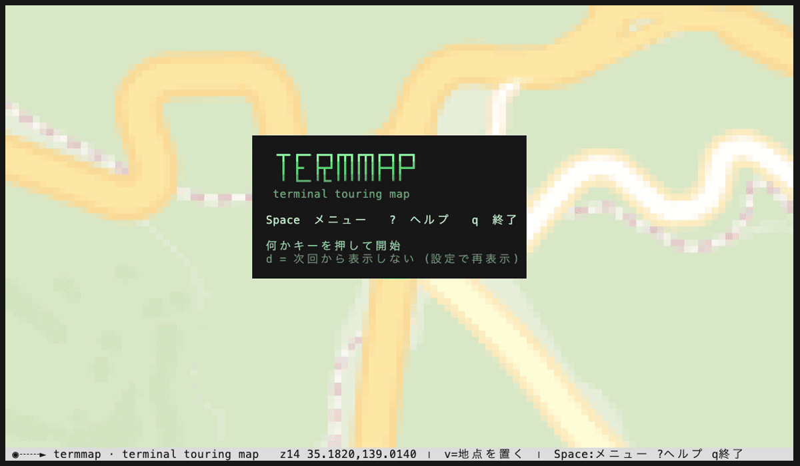
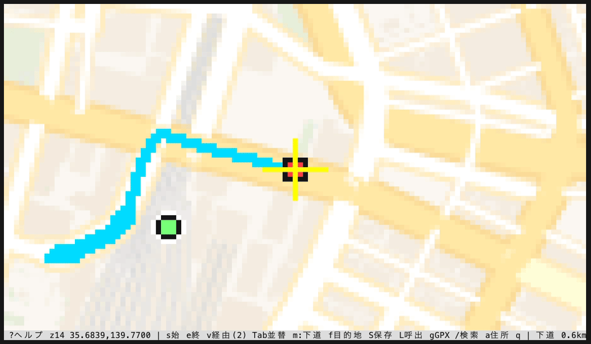
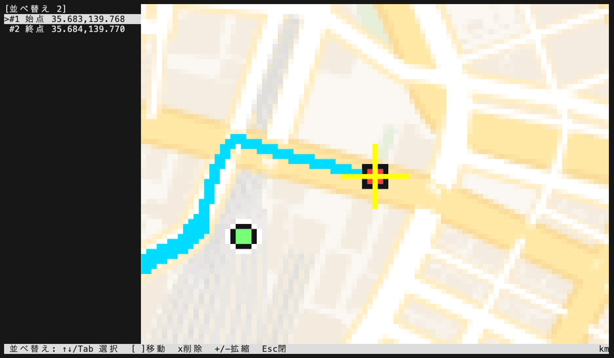
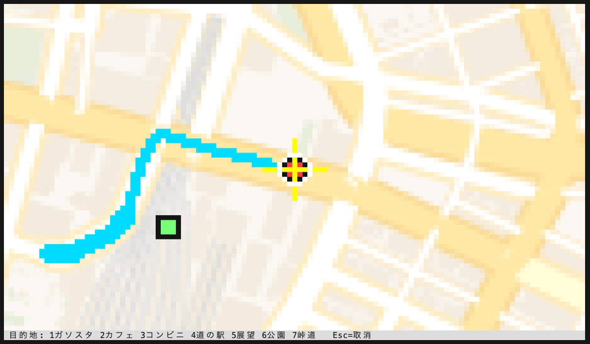
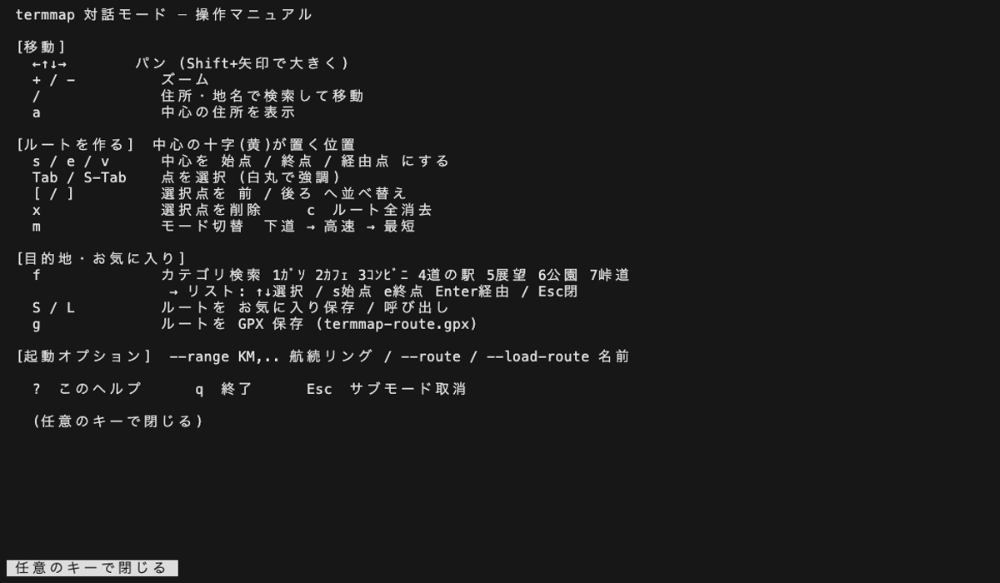
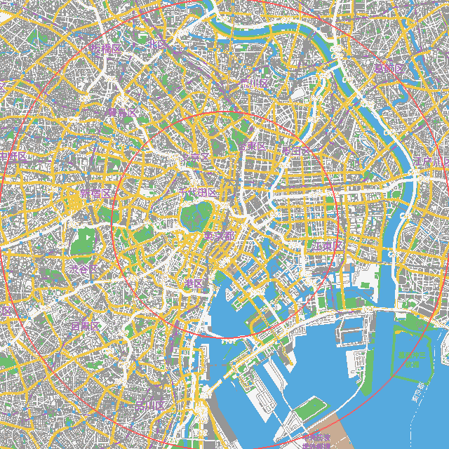

OpenStreetMap のタイルを端末に描画する地図ツール。ルート・目的地(POI)・航続リング・マイスポットを組み合わせて、端末上でツーリング計画を立てられる。対話モード(`-i`)の全操作を機能グループ別にまとめる。

## インストール / ビルド

```
cargo build --release
```

ビルドすると `target/release/termmap` にバイナリができる。以降はこのバイナリを実行する。

## 基本の使い方

住所や地名を指定して地図を出す。

```
termmap --place "東京都北区田端"
```

緯度経度で中心を指定することもできる。

```
termmap --lat 35.681 --lon 139.767
```

対話モードで起動すると、キー操作で地図を動かしながらルート・目的地・お気に入りを組み立てられる。

```
termmap --place "東京駅" -i
```

CLI オプションの全リストは `README.md` を参照。

## Space メニュー

`Space` でメニューを開く。カテゴリ→項目の2階層。

- トップ(カテゴリ一覧): `↑` `↓` でカテゴリ選択、`Enter` で展開、`Esc` で閉じてMapへ戻る
- 展開後(項目一覧): `↑` `↓` で項目選択、`Enter` で実行、`Esc` でカテゴリ一覧へ戻る
- トップ画面では各項目の右端キー(例 `/` `f` `s` `m` 等)を直接押しても、カテゴリを開かずその場で実行できる(熟練者向け)。展開後の画面ではそのカテゴリ内のキーだけが効く

カテゴリと項目:

| カテゴリ | 項目 | キー |
|---|---|---|
| 検索・移動 | 地名を検索 | `/` |
| | 目的地を探す | `f` |
| | 中心の住所を見る | `a` |
| | おすすめを出す | `@` |
| ルート作成 | ルートを組み立てる | `R`(このメニューからのみ開ける) |
| | 始点を設定 | `s` |
| | 終点を設定 | `e` |
| | 経由地を追加 | `v` |
| | 道路名から追加 | `r` |
| | おまかせ周回 | `W` |
| | 移動モード切替 | `m` |
| | 別ルートを検索 | `n` |
| | ルートを消去 | `c` |
| スポット | マイスポットを開く | `P` |
| | スポット表示を切替 | `V` |
| ナビ・表示 | 標高プロファイル | `E` |
| | 実写を見る | `i` |
| | ルートを再生 | `A` |
| | ライブ現在地 | `G` |
| 保存・共有 | ルートを保存 | `S` |
| | 保存ルートを開く | `L` |
| | GPXを書き出す | `g` |
| | QRで共有 | `o` |
| 設定・ヘルプ | 設定を開く | `,` |
| | ヘルプ | `?` |

各項目はメニュー経由でも直接キーでも同じ処理を実行する(内部的に共通のアクションに集約)。「ルートを組み立てる」(`R`)だけは他のキーと違い、地図上での単独キーバインドを持たず、この Space メニューからのみ開ける。

## キー一覧(機能グループ別)

### 移動
- `←` `↑` `↓` `→` パン(Shift+矢印で大きく移動)
- `+` `-` ズーム
- `Enter` 中心付近の最寄りマイスポットにスナップして名前をポップアップ表示(一定距離以内に無ければ「近くにお気に入り無し」)
- `Space` メニューを開く

### 検索
- `/` 住所・地名で検索して移動(Google Geocoding優先→Nominatim)。結果は左袖リストへ(→PoiList参照)
- `a` 中心の住所を表示(逆ジオコーディング)
- `f` 目的地カテゴリ検索(1ガソスタ 2カフェ 3コンビニ 4道の駅 5展望 6公園 7峠道)。リスト中の `/` でキーワード周辺検索に切替(→PoiMenu/PoiList参照)
- `@` おすすめ: 方向性のテキストを入力するとAI(`claude` CLI)が提案し、実在確認(geocode)した候補だけをリスト表示する。`config.toml [llm] recommend_enabled` がOFF、または `claude` コマンドが無い場合は使えない

### ルートを作る
- `s` / `e` / `v` 地図中心を 始点 / 終点 / 経由点(終点手前に挿入) にする
- `Tab` / `Shift+Tab` 並べ替えパネルを開く(→WaypointList参照)。パネルを開かなくても `[` `]` `x` は現在選択中の点に対して地図上で直接効く
- `[` / `]` 選択中の点を前 / 後ろへ並べ替え
- `x` 選択中の点を削除
- `c` ルートを全消去
- `m` 移動モード切替 下道 → 高速 → 最短(サイクル)
- `n` BRouter の代替ルート候補を巡回(案 1〜4)。ルート未確定では無効
- `r` 道路名/refをテキスト入力し、現在の表示範囲内にある道路を経路に追加する(例: 国道16号 / E20)。複数回 `r` で道を連結できる(点数の上限150。超えると先頭から切り詰め)
- `W` 走りまくり: 中心から峠道/展望スポットを巡る周回(既定)または片道ルートを自動生成。距離目安・形状は起動時の `--dist` `--shape` に従う。連打すると別案が出る
- Space→ルート作成→`R` ルート作成フォーム(→RouteForm参照)

### マイスポット
- `P` カテゴリ一覧を開く(→SpotCatList参照)
- `V` マイスポットの表示/非表示を切替

### 表示・ナビ
- `E` 標高プロファイルの表示/非表示。ルート確定後のみ機能する(未確定時は「ルート確定後に表示」と案内)
- `A` ルート再生(プレビュー走行)の開始/停止。ルート全体を自動パンしながらなぞる。要ルート確定
- `G` ライブ現在地のON/OFF。CoreLocationCLIを5秒ごとに呼び、自位置と軌跡(ブレッドクラム)を表示する。CoreLocationCLIが無い場合は案内を表示
- `i` 実写(Street View)を中心地点で全画面表示(→StreetView参照)

### 保存・共有
- `S` 現在のルートに名前を付けて保存(お気に入りルート)
- `L` 保存済みルートの一覧から呼び出し
- `g` ルートを GPX ファイル(`termmap-route.gpx`。カレントディレクトリ)として保存
- `o` スマホ共有: ルートをGoogleマップ経路URL化しQRコードをポップアップ表示(任意キーで閉じる)。経由点が10点を超える場合は末尾寄りを間引く

### 設定・その他
- `,` 設定画面を開く(→Settings参照)
- `?` ヘルプ全画面を表示(任意キーで閉じる)
- `q` 終了(地図画面でのみ有効。サブ画面では先に `Esc` で戻る)
- `Esc` サブ画面を一段階閉じる/戻る。地図画面では何もしないが、通信中のジョブがあれば中断に使われる
- `Ctrl+C` 進行中の通信(検索/ルート計算/実写取得/おすすめ)を中断する。アプリ自体は終了しない

## 各画面の操作

### PoiList(住所検索・目的地検索・周辺検索の結果リスト)
- `↑` `↓` 選択
- `Enter` 選択地点へ地図を移動(ルートには追加しない)
- `s` / `e` / `v` 選択地点を 始点 / 終点 / 経由 にする
- `P` 選択地点をマイスポットに登録(登録先カテゴリの選択へ遷移)
- `f` 目的地カテゴリ選択(PoiMenu)へ戻る
- `Esc` リストを閉じて地図へ戻る

リストが画面に収まらない場合は「位置(N/総数)」と上下の続き表示が出て、選択位置に合わせて自動スクロールする。

### PoiMenu(目的地カテゴリ選択)
- `↑` `↓` 選択、数字キー `1`〜`7` で対応カテゴリへ直接ジャンプ
- `Enter` 選択カテゴリで検索(結果はPoiListへ)
- `/` キーワードでの周辺検索(NearSearch)へ
- `Esc` 取消して地図へ戻る

### RouteForm(ルート作成フォーム。Space→ルート作成→ルートを組み立てる)
左袖に「始点/経由(複数)/終点/操作」の行を表示。地図は見えたままなので、中心を動かしてから各行を確定する。
- `↑` `↓` 行選択
- `Enter` 行の操作を実行: 始点/終点=地図中心を設定、経由=無操作(削除は`x`)、＋経由地を追加=地図中心を経由に追加、＋道路名で追加=道路名テキスト入力へ、移動モード=下道→高速→最短切替、▶ルートを引く=ルート計算実行、✕ルートを消去、←戻る=地図へ
- `x` 選択行が経由点なら削除
- `[` / `]` 選択行が経由点ならその点を前 / 後ろへ並べ替え
- `Esc` 地図へ戻る

### WaypointList(並べ替えパネル。Tab/Shift+Tabで開く)
- `↑` `↓` / `Tab` / `Shift+Tab` 点を選択(白丸で強調)
- `[` / `]` 選択点を前 / 後ろへ移動
- `x` 選択点を削除(空になったら自動的に閉じる)
- `+` / `-` ズーム(パネルを開いたまま操作可)
- `Esc` / `Enter` 閉じて地図へ戻る

### SpotCatList(マイスポットのカテゴリ一覧)
- `↑` `↓` 選択
- `Enter` そのカテゴリの中へ(SpotListへ)。検索結果からの登録待ち(`P`で来た場合)はそのカテゴリに直接登録
- `n` 新規カテゴリを作成
- `r` 選択カテゴリを改名
- `c` 選択カテゴリの色を変更(→ColorPick)
- `x` 選択カテゴリを削除(中にスポットが無い場合のみ。使用中なら「使用中」と表示)
- `[` / `]` 選択カテゴリを前 / 後ろへ並べ替え
- `Esc` 地図へ戻る(登録待ちがあれば取消)

### SpotList(カテゴリ内のスポット一覧)
- `↑` `↓` 選択
- `Enter` 選択スポットの位置へ地図を移動
- `n` 新規スポット登録フォーム(SpotForm)を開く(現在地=地図中心が既定)
- `r` 選択スポットを改名
- `m` 選択スポットの位置を今の地図中心へ上書き(`y`=実行 / 他キー=取消の確認を挟む)
- `[` / `]` 同カテゴリ内で選択スポットを前 / 後ろへ並べ替え
- `x` 選択スポットを削除
- `Esc` カテゴリ一覧(SpotCatList)へ戻る

### SpotForm(新規スポット登録フォーム)
項目は 名称 / URL / 送信 / 戻る の4つ。
- `↑` `↓` / `Tab` / `Shift+Tab` 項目移動
- 名称・URL欄では文字入力・貼り付け(Cmd+V)がそのまま反映される
- `Enter`: 名称欄→URL欄へ、URL欄→送信欄へ、送信欄→登録実行、戻る欄→SpotListへ(取消)
- 登録ルール: URL欄にGoogleマップの通常URL(`/place/…` や `!3d…!4d…` を含むもの。短縮URL `goo.gl` / `maps.app` は不可)を貼ると座標と店名を自動抽出する。URLが空なら現在の地図中心+入力した名称で登録する。名称欄に入力があればURLから取れた店名より優先される
- `Esc` 取消してSpotListへ戻る

### ColorPick(スポットカテゴリの色選択)
- `←` `→` パレットを選択
- `Enter` 決定して保存
- `Esc` 取消

### RouteList(お気に入りルート呼び出し。`L`)
- `↑` `↓` 選択
- `Enter` 選択ルートを読み込み、始点を中心に移動
- `Esc` 閉じる

### RoadSearch(道路名/refでの追加。`r`)
- 道路名またはrefをテキスト入力(貼り付け可)
- `Enter` 現在の表示範囲内で検索し、見つかれば経路の末尾に連結。範囲内に無ければ「道路が見つからない」と表示
- `Esc` 取消

### Recommend(おすすめ。`@`)
- 行きたい方向性・エリア等をテキストで入力
- `Enter` AI(`claude` CLI)へ提案を依頼し、返ってきた候補を実在確認(geocode)した上でPoiListへ表示
- `Esc` 取消

### StreetView(実写。`i`)
- 中心地点の実写を全画面表示
- `←` `→` 向きを回転
- `↑` `↓` 前後移動(隣のパノラマへスナップ)
- `Esc` / `q` 地図へ戻る
- 要件: `config.toml` の `[google] maps_api_key`(または環境変数 `TERMMAP_GOOGLE_API_KEY`)が設定済みで、かつ `[streetview] enabled = true` であること

### Settings(設定画面。`,`)
- `↑` `↓` 項目選択
- `Enter` / `Space` 選択項目を切替(道の点間隔のみ `←` `→` で100m刻み・100〜5000mの範囲)
- `s` 現在の設定を `config.toml` へ保存
- Google APIキー行では貼り付け(Cmd+V)でそのままキーを設定できる
- `Esc` 閉じて地図へ戻る

項目: 点字ドット / 地物色分け / 輪郭抽出 / 単色 / 地図種別(osm→voyager→dark→light循環) / 既定ルート(下道→高速→最短循環) / 道路の点間隔 / スポット既定表示 / おすすめON-OFF / 提案AIモデル(sonnet→haiku→opus循環) / 実写ON-OFF / Google APIキー

### QR表示・名前ポップアップ・登録確認ダイアログ
- QRコード(`o`、共有)・スポットの名前ポップアップ(Enterでのスナップ時)は、任意のキーで閉じる
- スポット位置の上書き確認(`m`)は `y` で実行、他キーで取消

## ツーリングの流れ(例)

1. `-i` で起動する。
2. `/` で出発地へ移動する。
3. `s` で始点を置く。
4. 目的地へ `/` で移動する。
5. `e` で終点を置く。
6. 経由したい所へ `/` で移動して `v` で経由点を置く。
7. `m` で下道 / 高速 / 最短を切り替える。
8. `S` で名前を付けて保存する。
9. 次回は `--load-route 名前` で呼び出す。
10. スマホで走るときは `--load-route 名前 --share` で Googleマップ経路URL + QR を出し、スキャンしてマップアプリで開く(または `--gpx` で書き出して OsmAnd 等に読ませる)。
11. 目的地の候補が定まらないときは `W`(走りまくり)で峠・展望を巡る周回案を出し、連打で別案に切り替えてもよい。

## 画面と使用例

対話モードの一連の操作(始点→終点→モード切替→並べ替え→目的地検索→ヘルプ)。



ルートを引いた状態。緑=始点、黄十字=中心、水色=経路。下部が操作バー。



Tab の並べ替えパネル。左袖に順序を表示し、選択行を強調する。



f の目的地検索(ガソスタ)。左袖に中心からの距離順でリスト表示する。



? のヘルプ(操作一覧)。



航続リング(--range)。中心から半径5km・10kmの同心円。



## 起動オプション(CLI・抜粋)

対話モードに関係するものだけ抜粋する。全リストは `README.md` を参照。

- `--range KM,..` / `--home LAT,LON` 航続リング
- `--route "LAT,LON;.."` / `--route-mode surface|highway|short` ルート
- `--gpx OUT` / `--save-route N` / `--load-route N` / `--routes` / `--share` GPX・お気に入り・共有
- `--wander` / `--dist KM` / `--shape loop|oneway` 走りまくりの既定値(`W`キーもこれに従う)
- `--here` / `--resume` 中心の指定
- `--style osm|voyager|dark|light` / `--edge` / `--classify` / `--braille` / `--width N` 描画

## データと通信

- 地図タイル: OpenStreetMap(標準) / CARTO(voyager・dark・light)
- ルート: BRouter
- 目的地・周辺検索: Overpass
- 住所検索: Google Geocoding(キー設定時・優先) → Nominatim / 逆ジオコーディング: Nominatim
- 実写: Google Street View Static API(要キー)
- 現在地: CoreLocationCLI(要 macOS + Location Services 許可)
- おすすめ: `claude` CLI

いずれもオンラインAPIを使う。タイルはセッション内のメモリキャッシュのみで、再起動すると最新のOSMを取り直す。検索結果は緯度経度を0.01度(約1km)単位に丸めたキーで `~/.config/termmap/search-cache.tsv` に永続キャッシュされ、同条件の再検索はAPIを叩かない。オフラインには対応していない。

## 保存先ファイル

- 設定: `~/.config/termmap/config.toml`
- 直近の位置/ズーム/style/ルート(`--resume`用): `~/.config/termmap/last.txt`
- お気に入りルート: `~/.config/termmap/routes/<名前>.txt`
- マイスポット: `~/.config/termmap/spots.txt` / カテゴリ: `~/.config/termmap/spot-categories.txt`
- 検索結果キャッシュ: `~/.config/termmap/search-cache.tsv`
- 初回起動オンボーディングの既読マーカー: `~/.config/termmap/onboarded`

## 注意

- 高速料金は概算。高速区間の距離 × ¥30 で、普通車・割引なしの前提で計算する。実額とは異なる。
- 下道モードは BRouter の moped プロファイルを使い、高速を回避する。高速モードは car-fast、最短モードは shortest プロファイルを使う。
- 住所検索は番地まで含めて0件だと、丁目・番地・番・号などの末尾を落として大字/町名レベルで自動的に再検索する(Nominatimは日本の番地レベル住所を持たないため)。
