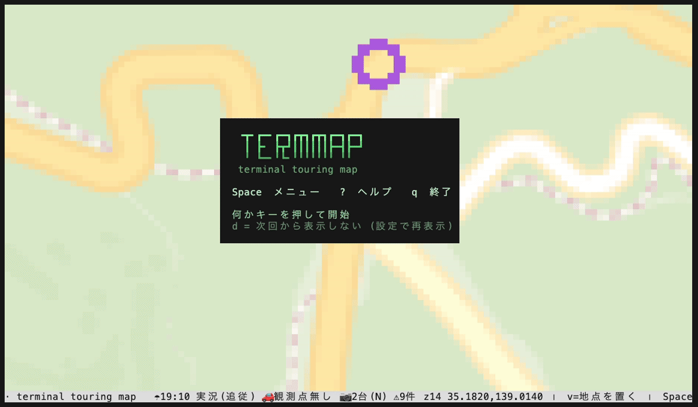
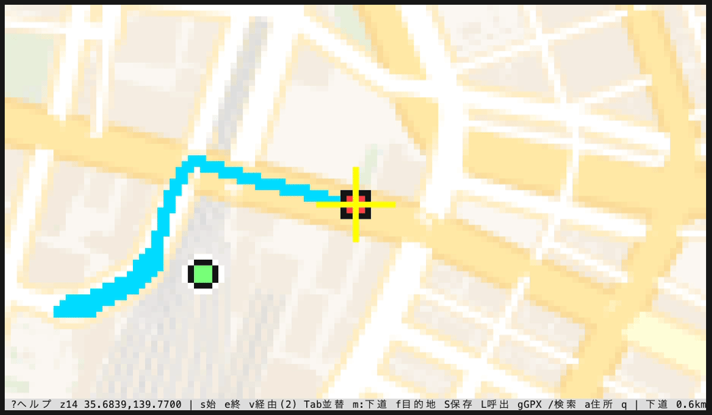
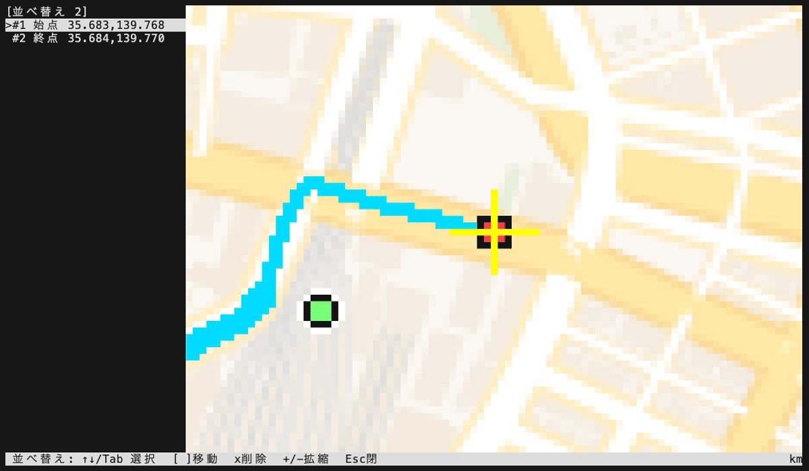
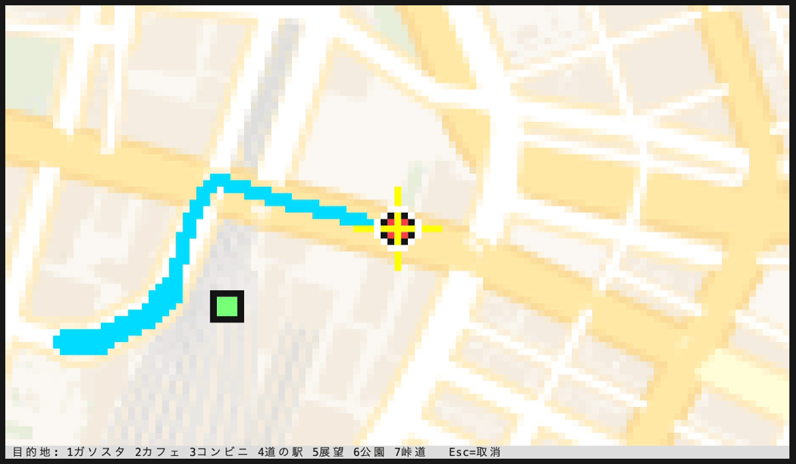
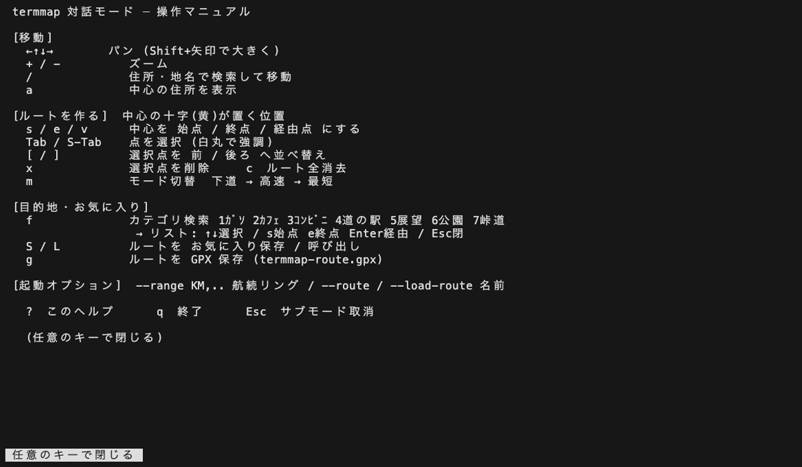
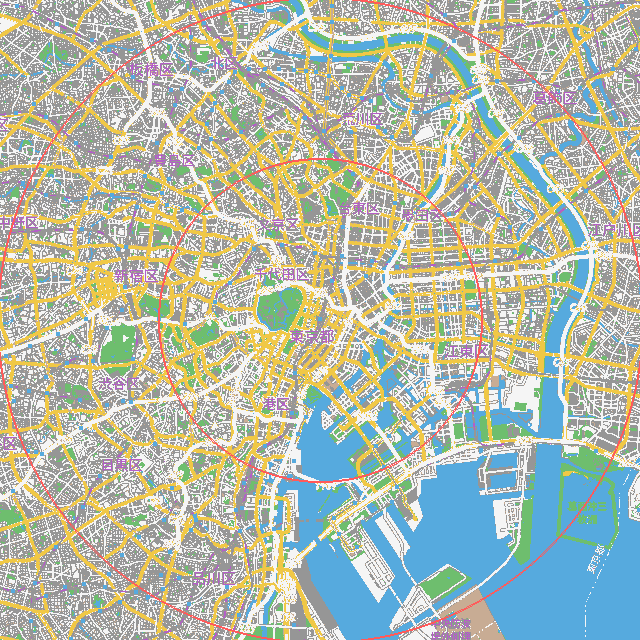

OpenStreetMap のタイルを端末に描画する地図ツール。ルート・目的地(POI)・航続リング・マイスポットを組み合わせて、端末上でツーリング計画を立てられる。対話モード(`-i`)の全操作を機能グループ別にまとめる。

## インストール / ビルド

```
cargo build --release
```

ビルドすると `target/release/termmap` にバイナリができる。以降はこのバイナリを実行する。

## 基本の使い方

住所や地名を指定して地図を出す。

```
termmap --place "東京都北区田端"
```

緯度経度で中心を指定することもできる。

```
termmap --lat 35.681 --lon 139.767
```

対話モードで起動すると、キー操作で地図を動かしながらルート・目的地・お気に入りを組み立てられる。

```
termmap --place "東京駅" -i
```

CLI オプションの全リストは `README.md` を参照。

## Space メニュー

`Space` でメニューを開く。カテゴリ→項目の2階層。

- トップ(カテゴリ一覧): `↑` `↓` でカテゴリ選択、`Enter` で展開、`Esc` で閉じてMapへ戻る
- 展開後(項目一覧): `↑` `↓` で項目選択、`Enter` で実行、`Esc` でカテゴリ一覧へ戻る
- トップ画面では各項目の右端キー(例 `/` `f` `s` `m` 等)を直接押しても、カテゴリを開かずその場で実行できる(熟練者向け)。展開後の画面ではそのカテゴリ内のキーだけが効く

カテゴリと項目:

| カテゴリ | 項目 | キー |
|---|---|---|
| 検索・移動 | 地名を検索 | `/` |
| | 目的地を探す | `f` |
| | 中心の住所を見る | `a` |
| | おすすめを出す | `@` |
| ルート作成 | ルートを組み立てる | `R`(このメニューからのみ開ける) |
| | 地点を置く(中心) | `v` |
| | 道路名から追加 | `r` |
| | おまかせ周回 | `W` |
| | 移動モード切替 | `m` |
| | 別ルートを検索 | `n` |
| | ルートを消去 | `c` |
| スポット | マイスポットを開く | `P` |
| | スポット表示を切替 | `V` |
| ナビ・表示 | 標高プロファイル | `E` |
| | 実写を見る | `i` |
| | ルートを再生 | `A` |
| | ライブ現在地 | `G` |
| | 雨雲レーダー | `C` |
| | 人口メッシュ | `U` |
| | 過去災害の塗り | `F` |
| 保存・共有 | ルートを保存 | `S` |
| | 保存ルートを開く | `L` |
| | GPXを書き出す | `g` |
| | QRで共有 | `o` |
| 設定・ヘルプ | 設定を開く | `,` |
| | ヘルプ | `?` |

各項目はメニュー経由でも直接キーでも同じ処理を実行する(内部的に共通のアクションに集約)。「ルートを組み立てる」(`R`)だけは他のキーと違い、地図上での単独キーバインドを持たず、この Space メニューからのみ開ける。

## キー一覧(機能グループ別)

### 移動
- `←` `↑` `↓` `→` パン(Shift+矢印で大きく移動)
- `h` `j` `k` `l` パン常に大きく移動(Shift+矢印の代替。修飾キー無しの文字なのでiSH等Shift+矢印非対応端末でも効く)
- `+` `-` ズーム
- `Enter` 中心付近の最寄りマイスポットにスナップして名前をポップアップ表示(一定距離以内に無ければ「近くにお気に入り無し」)
- `Space` メニューを開く

### 検索
- `/` 住所・地名で検索して移動(Google Geocoding優先→Nominatim)。結果は左袖リストへ(→PoiList参照)
- `a` 中心の住所を表示(逆ジオコーディング)
- `f` 目的地カテゴリ検索(1ガソスタ 2カフェ 3コンビニ 4道の駅 5展望 6公園 7峠道)。リスト中の `/` でキーワード周辺検索に切替(→PoiMenu/PoiList参照)
- `@` おすすめ: 方向性のテキストを入力するとAI(`claude` CLI)が提案し、実在確認(geocode)した候補だけをリスト表示する。`config.toml [llm] recommend_enabled` がOFF、または `claude` コマンドが無い場合は使えない

### ルートを作る
- `v` 地図中心クロスヘアに地点を追加(末尾へ)。役割は並び順で自動決定(先頭=始点/末尾=終点/間=経由)
- `Tab` / `Shift+Tab` 並べ替えパネルを開く(→WaypointList参照)。パネルを開かなくても `[` `]` `x` は現在選択中の点に対して地図上で直接効く。地図のまま`w`/`s`でも一覧(点+操作行)を上下できる
- `[` / `]` 選択中の点を前 / 後ろへ並べ替え
- `x` 選択中の点を削除
- `c` ルートを全消去(確認あり: `y`=消去 / 他キー=取消)
- `m` 移動モード切替 下道 → 高速 → 最短(サイクル)
- `n` BRouter の代替ルート候補を巡回(案 1〜4)。ルート未確定では無効
- `r` 道路名/refをテキスト入力し、現在の表示範囲内にある道路を経路に追加する(例: 国道16号 / E20)。複数回 `r` で道を連結できる(点数の上限150。超えると先頭から切り詰め)
- `W` 走りまくり: 中心から峠道/展望スポットを巡る周回(既定)または片道ルートを自動生成。距離目安・形状は起動時の `--dist` `--shape` に従う。連打すると別案が出る
- Space→ルート作成→`R` ルート作成フォーム(→RouteForm参照)

### マイスポット
- `P` カテゴリ一覧を開く(→SpotCatList参照)
- `V` マイスポットの表示/非表示を切替

### 表示・ナビ
- `E` 標高プロファイルの表示/非表示。ルート確定後のみ機能する(未確定時は「ルート確定後に表示」と案内)
- `A` ルート再生(プレビュー走行)の開始/停止。ルート全体を自動パンしながらなぞる。要ルート確定
- `G` ライブ現在地のON/OFF。CoreLocationCLIを5秒ごとに呼び、自位置と軌跡(ブレッドクラム)を表示する。CoreLocationCLIが無い場合は案内を表示
- `i` 実写(Street View)を中心地点で全画面表示(→StreetView参照)

### 雨雲レーダー
気象庁の降水ナウキャスト(直近60分)+降水短時間予報(60分〜15時間先)を地図に半透明で重ねる。
出典: 気象庁ナウキャスト・降水短時間予報。

- `C` 雨雲レーダーの表示/非表示。ONにすると必ず最新の実況から始まる
- `>` 表示時刻を未来へ1コマ。+60分までは5分刻み、それより先は降水短時間予報に切り替わり1時間刻みで最大+15時間まで。OFFのときに押すとONにして最新の実況から始める
- `<` 表示時刻を過去へ1コマ(5分)。OFFのときは何もしない(誤爆でONにしない)
- 最新の実況ちょうどに戻すと追従モードへ復帰し、以後は5分ごとの更新に自動で追いつく(ステータス行に `(追従)` と出る)
- ステータス行の表示: `☂15:00実況(追従)` / `☂15:30予報+30分` / `☂…読込3/9`(タイル取得中) / `☂時刻取得中…` / `☂範囲外`(日本国外を表示中は1枚も取りに行かない)
- 起動時のON/OFFと濃さ(薄い/標準/濃い)は設定画面(`,`)と `config.toml [radar]` で変えられる
- 表示時刻の一覧は既定300秒ごとに取り直す。タイルはメモリキャッシュのみでディスクには保存しない(古い雨を新しい雨として見せないため)

### ルート音声案内
設定画面(`,`)の「ルート音声案内」でONにすると、確定済みルートの曲がり角を音声で案内する。専用キーは無く、設定画面のみで切替。

- ルートが決まる(または音声案内をONにした)たびに、BRouterへ曲がり角情報(turnInstructionMode)を追加で問い合わせる。ONにした人だけが問い合わせる(既定OFF)
- ライブ現在地(`G`キーのMac本体GPS、またはweb版の📍ボタンのスマホGPSのどちらでも可)が動くたびに、次の曲がり角までの残り距離を判定する
- 300m手前で1段階目(例:「300メートル先、左折です」)、30m手前(直前)で2段階目(例:「左折です」)を1回ずつ読み上げる。通過済みの曲がり角は読み上げ直さない
- 読み上げの実体: ローカル実行時はmacOSの`say`コマンド、web(ttyd)実行時はブラウザのWeb Speech API(既存の効果音と同じOSC経由の合図で伝える)。どちらか対応する側だけが実際に鳴る
- 案内できるのは右左折・分岐・Uターン等の方向まで。BRouterのポリラインは道なりの細かいカーブ情報を持たないため、カーブそのものの警告(この先急カーブ等)はしない
- 設定画面の「読み上げの声」(macOSのみ)で`say`の声を選べる。Enterで一覧を開くとインストール済みの日本語音声(`say -v '?'`で列挙)が並び、Spaceでその場で試聴・Enterで確定して1回試聴する。試聴はweb版越しに設定していてもこの端末(Mac本体)側で鳴る。web版(ブラウザ)側の声は選択できず、ブラウザが自動で選ぶ

### 通行止めの回避
設定画面(`,`)の「通行規制」をONにすると、実施中の通行止め区間をルート計算(BRouter)でも
避けるようになる。地図に表示するだけの設定(§通行規制)と同じON/OFFで連動する。

- 対象は通行止め(黒い線)のみ。車線規制・片側交互通行等は通行不能ではないため対象外
- まだ始まっていない(予定段階の)通行止めは対象外。実施中のものだけを避ける
- 経由地全体を覆う範囲にある対象区間を円(半径100m)に変換し、BRouterへ絶対回避エリアとして渡す
- 対象が多すぎる(50件超)場合は経由地に近い方を優先し、残りは諦める。この場合ルートの
  要約に「(通行止めの一部は回避対象外)」と出る
- 通行止めで迂回できない(道が無い)場合は、通常のルート計算失敗と同じエラー表示になる
- Google Directionsへのフォールバック(BRouterが最終的に失敗した場合)は、Google側が
  通行止め情報を持たないため回避を保証できない。この場合の結果はディスクキャッシュに
  保存しない(BRouterが復旧した後も古いフォールバック経路を出し続けないため)

### 規制原因アイコン(事故✕/工事)
「通行規制」ONの状態で表示される通行止め(黒い線)のうち、規制原因が判明した区間には
中点にアイコンを重ねて表示する。事故は赤い✕、工事(工事/道路工事/架橋工事/作業等)は
黄色い三角。原因が災害・道路損壊等それ以外の場合はアイコンを出さず、従来通り線のみ。

- 規制原因は表示中の通行止めについて1件ずつバックグラウンドで取得する(同時に1件のみ、
  取得済みはセッション中ずっと再利用)。取得が終わるまではアイコンは出ず、線だけ表示される
- 実データ調査(2026/08/17)では通行止めの原因に「事故」はほぼ現れない(災害・工事系が主)。
  事故アイコンは将来別データ源が加わった時のための受け皿

### 過去災害の塗り(市区町村ごとのコロプレス)
設定画面の「過去災害」をONにすると、市区町村の境界(気象庁)ごとに過去の災害記録の多さで
地図を塗り分ける。雨雲レーダーと同じ半透明合成なので、下の地図は透けて見える。
塗りのON/OFFは`F`キーでも切り替えられる(Spaceメニュー・設定画面と共通処理)。
色はその市区町村で最も件数の多い災害種別(風水害=青 / 地震=赤 / 雪氷=淡青 / 斜面=茶 等)、
濃さは記録の件数(5段)。塗りだけを切ってマーカー表示に戻したい場合は「過去災害の塗り」をOFFにする。

- **濃い色は「危険度」ではない。** あくまで過去に記録が残っている件数で、記録の粗密は当時の
  報告体制にも左右される。件数が少ない=安全、という読み方はできない
- 面積あたりの密度にはしていないので、広い市町村ほど件数が多く出る偏りが残る
- ズームによって出し分ける。z11〜z13は塗り+縁取り、z14は縁取りのみ(画面が1市区町村で
  埋まって塗りが情報を持たなくなるため)、z15以上は従来のマーカーだけ。地点マーカー自体は
  どのズームでも残る(`B`が何を指しているか分かるように)
- 塗りが出ている間は、ステータス行が地点数の代わりに中心十字がいる市区町村を出す
  (例 `🌊野田市 89件(B)`)。境界は簡略化された形なので、この市区町村名は目安
- braille / 輪郭抽出モードでは、面をそのまま塗ると線画が単色に潰れるため、色の粒を疎に
  撒く点描で表現する
- 件数は防災科学技術研究所、境界は気象庁と提供元が別なので、市区町村コードで突き合わせている。
  合併等でコードがずれている市区町村はごく稀に塗られないことがある(全国で1件の実測)

### 500mメッシュ人口

設定画面(`,`)の「人口メッシュ」をONにするか `U` を押すと、500mメッシュごとの推計人口
(国土数値情報)を人口密度として地図に塗り重ねる。走る前に補給(コンビニ・給油・宿)が
期待できる帯を見たいとき、夜間・林道で明かりと電波が無い区間を避けたいときに使う。

- 色は紫〜マゼンタの単一色相で、濃いほど人が多い。7段階(人/km²):
  〜100(山間・過疎) / 100〜1,000(農村) / 1,000〜4,000(郊外) / 4,000〜10,000(地方都市) /
  10,000〜20,000(住宅密集) / 20,000〜(都心)。人口0とデータの無いメッシュは塗らない
- 人口の少ない土地ほど薄く塗るので、地図はそのまま読める。人が多い場所だけが浮き上がる
- ステータス行に、中心のクロスヘアが指すメッシュの実数値(例 `👥1,240人/km²`)が出る。
  色分けだけでは階級の幅しか分からないため
- z11 より広域では表示しない(メッシュが小さくなりすぎて階級が区別できないため)

取得は都道府県まるごと単位で、1都道府県が最大31MB・数十秒かかる。テザリングで無言で
落ちないよう既定はOFFで、取得中はステータス行に「👥北海道を取得中…」と出る。
一度取れば1年は取り直さない(推計の改定は数年に1度)。

- 濃さ(薄い/標準/濃い)と年次は設定画面で変えられる。年次は2020〜2070の5年刻みで、
  2020年は令和2年国勢調査に基づく実績、2025年以降は推計値。年を変えても取り直しは起きない
  (全年次をまとめて保存しているため)
- 秘匿処理されたメッシュは、公表値ではなくそのメッシュ自身の値(合算前)で塗る。
  公表値だと秘匿対象が0にされて隣が膨らむため、「人がいない帯」が実際とは違う場所に出る
- 出典: 国土数値情報(500mメッシュ別将来推計人口データ) 国土交通省
  https://nlftp.mlit.go.jp/ksj/ (令和2年国勢調査に基づく国土交通省国土政策局の推計・2024年12月公開)

### 高速道路区間の色分け
確定したルートのうち高速道路(自動車専用道)を通る区間は、ルート線を緑で上塗りして示す。
設定は無く常時表示される(BRouterの応答に入っている情報だけを使うので、追加の問い合わせは
発生しない)。ルート要約の「高速XX.Xkm」と同じ判定なので、表示される距離と色の付く区間は
必ず一致する。

- 高速を途中で一度降りるルートでは色の付く区間が複数に分かれ、要約に「高速32.3km(2区間)」
  のように区間数が出る(1区間のときは出さない)
- ランプ・JCT連絡路も高速に含めるため、IC入口からIC出口まで線が途切れない
- 路線名(東名・首都高など)は出ない。BRouterの応答に道路の名称が入っていないため
- 一般有料道路や有料の橋・トンネルは対象外(有料かどうかを判定する手段が無い)。料金概算にも
  入らない
- 高速区間が渋滞していれば、その上に渋滞の色分け(黄/赤)が乗る
- 下道モード(高速回避)ではそもそも高速を通らないので、表示は変わらない
- Googleフォールバックで取得したルート(要約に「(Google経由)」が付く)では色分けは出ない

### 渋滞状況の色分け
設定画面の「渋滞状況の色分け」をONにすると、ルート確定のたびにGoogle Directions
(`departure_time=now`)へ別途問い合わせる。ルート線は基調色(青)のままで、実際に
混雑している区間だけ黄(やや混雑)/赤(混雑)で上塗りする(順調な区間は何もしない)。
混雑区間が1つでもあれば、ルート要約に「(渋滞あり: 黄/赤)」と一言添える。

- 要Google APIキー。BRouterの渋滞回避(通行止めの回避)とは別物で、こちらは
  「表示中のルート上の渋滞状況」の目安表示のみ(ルート自体は変わらない)
- 通行止め表示(黒い線)とは別の色(黄/赤)を使うため混同しない
- 道路網全体の色分け(Googleマップの渋滞レイヤのような面表示)はGoogle側にデータ取得手段が
  無いため不可能。あくまで表示中のルート線だけを塗り分ける
- ルートを目標5km間隔の区間に分割し(最大24区間)、1回のGoogle Directionsリクエストで
  まとめて問い合わせる(区間ごとに個別リクエストはしない)
- Google Directions Advancedのリクエストが対象。個人利用の頻度なら通常は無料枠(月5,000件)内
- 取得に失敗した場合は静かに諦める(色分けが出ないだけで、ルート自体の表示は影響を受けない)

### 保存・共有
- `S` お気に入りルート(保存/呼び出し)の小メニューを開く(→RouteFavMenu参照)
- `g` ルートを GPX ファイル(`termmap-route.gpx`。カレントディレクトリ)として保存
- `o` スマホ共有: ルートをGoogleマップ経路URL化しQRコードをポップアップ表示(任意キーで閉じる)。経由点が10点を超える場合は末尾寄りを間引く

### 設定・その他
- `,` 設定画面を開く(→Settings参照)
- `?` ヘルプ全画面を表示(任意キーで閉じる)
- `q` 終了(地図画面でのみ有効。サブ画面では先に `Esc` で戻る)
- `Esc` サブ画面を一段階閉じる/戻る。地図画面では何もしないが、通信中のジョブがあれば中断に使われる
- `Ctrl+C` 進行中の通信(検索/ルート計算/実写取得/おすすめ)を中断する。アプリ自体は終了しない

## 各画面の操作

### PoiList(住所検索・目的地検索・周辺検索の結果リスト)
- `↑` `↓`(または`w` `s`) 選択(地図が追従)
- `←` `→`(または`a` `d`、`h` `l`) 一覧は動かさず地図だけ微パン。`j` `k` でも上下に微パンできる
- `+` `-` ズーム
- `Enter` 選択地点へ地図を移動(ルートには追加しない)
- `v` 選択地点をルートに追加(末尾。役割は並び順で自動決定)
- `P` 選択地点をマイスポットに登録(登録先カテゴリの選択へ遷移)
- `f` 目的地カテゴリ選択(PoiMenu)へ戻る
- `Esc` リストを閉じて地図へ戻る

リストが画面に収まらない場合は「位置(N/総数)」と上下の続き表示が出て、選択位置に合わせて自動スクロールする。

### PoiMenu(目的地カテゴリ選択)
- `↑` `↓` 選択、数字キー `1`〜`7` で対応カテゴリへ直接ジャンプ
- `Enter` 選択カテゴリで検索(結果はPoiListへ)
- `/` キーワードでの周辺検索(NearSearch)へ
- `Esc` 取消して地図へ戻る

### WaypointList(並べ替えパネル。Tab/Shift+Tab、またはSpace→ルート作成→ルートを組み立てるで開く)
- `↑` `↓` / `Tab` / `Shift+Tab` 点を選択(白丸で強調)
- `[` / `]` 選択点を前 / 後ろへ移動
- `x` 選択点を削除(空になったら自動的に閉じる)
- `+` / `-` ズーム(パネルを開いたまま操作可)
- `Esc` / `Enter` 閉じて地図へ戻る

### SpotCatList(マイスポットのカテゴリ一覧)
- `↑` `↓` 選択
- `Enter` そのカテゴリの中へ(SpotListへ)。検索結果からの登録待ち(`P`で来た場合)はそのカテゴリに直接登録
- `n` 新規カテゴリを作成
- `r` 選択カテゴリを改名
- `c` 選択カテゴリの色を変更(→ColorPick)
- `x` 選択カテゴリを削除(中にスポットが無い場合のみ。使用中なら「使用中」と表示)
- `[` / `]` 選択カテゴリを前 / 後ろへ並べ替え
- `Esc` 地図へ戻る(登録待ちがあれば取消)

### SpotList(カテゴリ内のスポット一覧)
- `↑` `↓` 選択
- `Enter` 選択スポットの位置へ地図を移動
- `n` 新規スポット登録フォーム(SpotForm)を開く(現在地=地図中心が既定)
- `r` 選択スポットを改名
- `m` 選択スポットの位置を今の地図中心へ上書き(`y`=実行 / 他キー=取消の確認を挟む)
- `[` / `]` 同カテゴリ内で選択スポットを前 / 後ろへ並べ替え
- `x` 選択スポットを削除
- `Esc` カテゴリ一覧(SpotCatList)へ戻る

### SpotForm(新規スポット登録フォーム)
項目は 名称 / URL / 送信 / 戻る の4つ。
- `↑` `↓` / `Tab` / `Shift+Tab` 項目移動
- 名称・URL欄では文字入力・貼り付け(Cmd+V)がそのまま反映される
- `Enter`: 名称欄→URL欄へ、URL欄→送信欄へ、送信欄→登録実行、戻る欄→SpotListへ(取消)
- 登録ルール: URL欄にGoogleマップの通常URL(`/place/…` や `!3d…!4d…` を含むもの。短縮URL `goo.gl` / `maps.app` は不可)を貼ると座標と店名を自動抽出する。URLが空なら現在の地図中心+入力した名称で登録する。名称欄に入力があればURLから取れた店名より優先される
- `Esc` 取消してSpotListへ戻る

### ColorPick(スポットカテゴリの色選択)
- `←` `→` パレットを選択
- `Enter` 決定して保存
- `Esc` 取消

### RouteFavMenu(お気に入りルート小メニュー。`S`)
- `↑` `↓`(または`w` `s`) 保存/呼び出しを選択
- `Enter` 選択を実行(保存→SaveName、呼び出し→RouteListへ)
- `Esc` 取消

### RouteList(お気に入りルート呼び出し。RouteFavMenu→呼び出し)
- `↑` `↓`(または`w` `s`) 選択
- `Enter` 選択ルートを読み込み、始点を中心に移動
- `Esc` 閉じる

### RoadSearch(道路名/refでの追加。`r`)
- 道路名またはrefをテキスト入力(貼り付け可)
- `Enter` 現在の表示範囲内で検索し、見つかれば経路の末尾に連結。範囲内に無ければ「道路が見つからない」と表示
- `Esc` 取消

### Recommend(おすすめ。`@`)
- 行きたい方向性・エリア等をテキストで入力
- `Enter` AI(`claude` CLI)へ提案を依頼し、返ってきた候補を実在確認(geocode)した上でPoiListへ表示
- `Esc` 取消

### StreetView(実写。`i`)
- 中心地点の実写を全画面表示
- `←` `→` 向きを回転(ステータスバーに8方向の矢印でも表示)
- `↑` `↓` 前後移動(隣のパノラマへスナップ)。地図の中心もこの位置へ追従するので、実写を閉じると歩いた先の地点が地図に表示される
- `+` `-` ズーム(画角を調整。Shiftで細かく)
- `Esc` / `q` 地図へ戻る
- 要件: `config.toml` の `[google] maps_api_key`(または環境変数 `TERMMAP_GOOGLE_API_KEY`)が設定済みで、かつ `[streetview] enabled = true` であること

### Settings(設定画面。`,`)
- `↑` `↓`(または `w` `s`) 項目選択
- `Enter` / `Space` 選択項目を切替。ON/OFF項目はそのままトグル、選択肢が3つ以上ある項目(地図種別/既定ルート/提案AIモデル/画像解像度/中心十字の色/QR表示方式/雨雲の濃さ)はその場でアコーディオン展開(項目の直下に候補がインデント表示され、他の項目は押し下げられる)
- 展開中: `↑` `↓`(または `w` `s`)で候補を選び `Enter` で確定して閉じる・`Esc` で変更せず閉じる
- 道路の点間隔のみ `←` `→` で100m刻み(100〜5000mの範囲)、または `Enter` で数値入力
- 変更内容はそのたびに自動保存される(手動保存キーは無し)
- Google APIキー行では貼り付け(Cmd+V)でそのままキーを設定できる
- `Esc` 閉じて地図へ戻る

項目: 点字ドット / 地物色分け / 輪郭抽出 / 単色 / 地図種別(osm/voyager/dark/light/topo・一覧選択) / 既定ルート(下道/高速/最短・一覧選択) / 道路の点間隔 / スポット既定表示 / おすすめON-OFF / 提案AIモデル(sonnet/haiku/opus・一覧選択) / 実写ON-OFF / 画像表示ON-OFF / 画像解像度(高/中/低・一覧選択) / 移動中の低解像度化ON-OFF / サウンドON-OFF / オンボーディングON-OFF / 中心十字の色(一覧選択) / Google APIキー / QR表示方式(標準/画像(小型)・一覧選択) / 雨雲レーダーON-OFF / 雨雲の濃さ(薄い/標準/濃い・一覧選択) / ルート音声案内ON-OFF / 道路交通量ON-OFF / 音声をこの端末でも再生ON-OFF / 道路ライブカメラON-OFF / 通行規制ON-OFF / 過去災害ON-OFF / 読み上げの声(macOSのみ・一覧選択+Space試聴) / 渋滞状況の色分けON-OFF / 過去災害の塗りON-OFF / 人口メッシュON-OFF / 人口の濃さ(薄い/標準/濃い・一覧選択) / 人口の年次(2020〜2070の5年刻み・一覧選択)

末尾の外部データレイヤ(道路交通量・道路ライブカメラ・通行規制・過去災害・人口メッシュ)はいずれも既定OFF。ONにした人だけが、その提供元へ問い合わせる。

雨雲レーダーの行はその場で表示が切り替わり、同時に起動時の既定(`config.toml [radar] enabled`)としても保存される。再取得間隔(`refresh_sec`)は設定画面には出さず `config.toml` のみで指定する。

### QR表示・名前ポップアップ・登録確認ダイアログ
- QRコード(`o`、共有)・スポットの名前ポップアップ(Enterでのスナップ時)は、任意のキーで閉じる
- スポット位置の上書き確認(`m`)は `y` で実行、他キーで取消
- ルート全消去(`c`)は `y` で実行、他キーで取消
- お気に入りルート保存(`S`→保存)で既存の名前を入力した場合、上書き確認が出る。`y`で上書き、他キーは名前欄に戻るので変えて新規登録できる。直近に読み込み/保存した名前は次に保存欄を開いたとき自動で入力されている

## ツーリングの流れ(例)

1. `-i` で起動する。
2. `/` で出発地へ移動して `v` で地点を置く(先頭=始点)。
3. 経由したい所へ `/` で移動して `v` で地点を置く(間=経由)。
4. 目的地へ `/` で移動して `v` で地点を置く(末尾=終点)。
5. `m` で下道 / 高速 / 最短を切り替える。
6. `S` で名前を付けて保存する。
7. 次回は `--load-route 名前` で呼び出す。
8. スマホで走るときは `--load-route 名前 --share` で Googleマップ経路URL + QR を出し、スキャンしてマップアプリで開く(または `--gpx` で書き出して OsmAnd 等に読ませる)。
9. 目的地の候補が定まらないときは `W`(走りまくり)で峠・展望を巡る周回案を出し、連打で別案に切り替えてもよい。

## 画面と使用例

対話モードの一連の操作(地点を置く→モード切替→並べ替え→目的地検索→ヘルプ)。



ルートを引いた状態。緑=始点、黄十字=中心、水色=経路。下部が操作バー。



Tab の並べ替えパネル。左袖に順序を表示し、選択行を強調する。



f の目的地検索(ガソスタ)。左袖に中心からの距離順でリスト表示する。



? のヘルプ(操作一覧)。



航続リング(--range)。中心から半径5km・10kmの同心円。



## 起動オプション(CLI・抜粋)

対話モードに関係するものだけ抜粋する。全リストは `README.md` を参照。

- `--range KM,..` / `--home LAT,LON` 航続リング
- `--route "LAT,LON;.."` / `--route-mode surface|highway|short` ルート
- `--gpx OUT` / `--save-route N` / `--load-route N` / `--routes` / `--share` GPX・お気に入り・共有
- `--wander` / `--dist KM` / `--shape loop|oneway` 走りまくりの既定値(`W`キーもこれに従う)
- `--here` / `--resume` 中心の指定
- `--style osm|voyager|dark|light|topo` / `--edge` / `--classify` / `--braille` / `--width N` 描画

## スマホのブラウザから使う(キーボード無しでの操作)

ttyd 経由でブラウザに出し、スワイプとタップで操作できる。セットアップ手順(ビルド →
`scripts/build-web-index.sh` → `scripts/serve-web.sh` → `cloudflared`)は `README.md` を参照。
termmap 側は通常起動と同じで、ブラウザのページに載せたオーバーレイがタッチ操作を
キー入力へ変換している。ただし地図のパンだけは矢印キーに変換せず、指の移動量を
そのまま termmap へ送って1:1で追従させている。何がどう動く軸なのか(地図パン/カーソル移動/
無効)は termmap 側が画面ごとに判定してブラウザへ通知する。

| タッチ操作 | 送られるキー | 動き |
|---|---|---|
| スワイプ(地図) | パン量を直接送る | 指の動きに地図が1:1でついてくる。フリックすると慣性で流れて止まる |
| スワイプ(一覧・メニュー) | `↑↓` | 指と同じ向きにカーソルが動く(慣性は効かない。狙った項目で止められる) |
| スワイプ(距離ゲージ `W`) | `←→` | 右へ払うと距離が増え、左へ払うと減る |
| タップ | `Enter` | 中心付近の最寄りお気に入りにスナップ |
| `Menu` ボタン | `Space` | メニュー。項目移動は上下スワイプ、決定はタップ |
| `−` / `＋` | `-` / `+` | ズーム |
| `☂` | `C` | 雨雲レーダー 表示/非表示 |
| `👥` | `U` | 人口メッシュ 表示/非表示 |
| `◀` / `▶` | `<` / `>` | 雨雲レーダーの表示時刻を前/後へ5分 |
| `Esc` | `Esc` | 戻る/取消 |
| `?` | `?` | ヘルプ |

- 終了(`q`)のボタンは置いていない。離脱はブラウザのタブを閉じる。
- 文字入力(住所検索 `/`、スポット名など)はソフトキーボードが要るため、この操作系だけでは完結しない。
- 縦持ちは端末幅が約50桁でステータス行の右側が切れる。横持ちにすると収まる。

## データと通信

- 地図タイル: OpenStreetMap(標準) / CARTO(voyager・dark・light)
- ルート: BRouter
- 目的地・周辺検索: Overpass
- 住所検索: Google Geocoding(キー設定時・優先) → Nominatim / 逆ジオコーディング: Nominatim
- 実写: Google Street View Static API(要キー)
- 現在地: CoreLocationCLI(要 macOS + Location Services 許可)
- おすすめ: `claude` CLI
- 雨雲レーダー: 気象庁 降水ナウキャスト(直近60分)+降水短時間予報(60分〜15時間先。キー不要)。どちらも開発者向けAPIとして公開されたものではない非公式エンドポイントの個人利用であり、予告なく停止しうる。取得は表示中の1コマ分だけで、先読みはしない
- 過去災害: 防災科学技術研究所 災害事例データベース(キー不要)。公式に問い合わせを受け付けていないAPIなので、予告なく仕様が変わりうる。地図には市区町村ごとの記録件数だけを取り、事例の中身は `B` を押したときだけ取りに行く
- 市区町村の境界: 気象庁(キー不要)。過去災害を市区町村ごとに塗り分けるためだけに使う。こちらも開発者向けに文書化されていないエンドポイントで、取れなくなったら塗りを出さず代表点マーカーの表示へ落ちる。境界は簡略化された形なので、塗りの範囲やステータス行の市区町村名は目安であって行政界の判定には使えない
- 500mメッシュ人口: 国土数値情報「500mメッシュ別将来推計人口データ」(国土交通省・キー不要)。都道府県単位の静的zipで、APIではない。表示している都道府県のぶんだけを取り、1度取れば1年は取り直さない
- 道路交通量・道路ライブカメラ・通行規制: 国土交通省の各種道路情報提供システム(キー不要・非公式)。地図には位置/線だけを重ね、通行規制の規制原因(なぜ通れないか)は `T` を押したときだけ取りに行く

いずれもオンラインAPIを使う。取得したデータは種類ごとにローカルへ保存し、同じものを何度も取りに行かないようにしている。

- 地図タイル: `~/.config/termmap/tiles` に30日間保存する。一度見た範囲はパンで戻っても再起動してもディスクから読む(雨雲レーダーのタイルだけは時刻入りで使い回せないため保存しない)。上限は設けていないので、広い範囲を見て回ると溜まる。不要なら削除してよい(次に見たときに取り直す)
- 検索結果: 緯度経度を0.01度(約1km)単位に丸めたキーで `~/.config/termmap/search-cache.tsv` に90日間保存し、同条件の再検索はAPIを叩かない
- 地図に重ねるデータ(道路交通量・主要道路・道路ライブカメラ・通行規制・過去災害・人口メッシュ): `~/.config/termmap/plot-cache` に保存する。有効期限は種類ごとに違い、交通量5分・通行規制10分・カメラ7日・主要道路30日・過去災害30日・市区町村境界180日・人口メッシュ365日。期限内は通信しない。期限を過ぎても圏外なら直前の内容を出し続け、その場合はステータス行に「(32分前)」のように経過時間が付く。交通量は60分、通行規制は24時間を超えたら古すぎるとみなして捨てる(過去災害は古くなっても捨てない。起きた災害の記録は変わらないため)

オフライン専用の動作(あらかじめ範囲をまとめて落としておく等)には対応していない。

## 保存先ファイル

- 設定: `~/.config/termmap/config.toml`
- 直近の位置/ズーム/style/ルート(`--resume`用): `~/.config/termmap/last.txt`
- お気に入りルート: `~/.config/termmap/routes/<名前>.txt`
- マイスポット: `~/.config/termmap/spots.txt` / カテゴリ: `~/.config/termmap/spot-categories.txt`
- 検索結果キャッシュ: `~/.config/termmap/search-cache.tsv`
- 地図タイルキャッシュ: `~/.config/termmap/tiles/<style>/<z>/<x>/<y>.png`(30日)
- 重ねるデータのキャッシュ: `~/.config/termmap/plot-cache/v1/{traffic,roads,camera,regulation,disaster,boundary,population}/`(過去災害だけは1次メッシュコードに年代しきい値を付けた `5339_1926.json` の形。市区町村境界は気象庁の10分割ファイルに対応する `c20s0.json`〜`c20s9.json`、人口メッシュは都道府県コード2桁の `13.json` の形)
- 初回起動オンボーディングの既読マーカー: `~/.config/termmap/onboarded`

## 注意

- 高速料金は概算。高速区間の距離 × ¥30 で、普通車・割引なしの前提で計算する。実額とは異なる。
- 下道モードは BRouter の moped プロファイルを使い、高速を回避する。高速モードは car-fast、最短モードは shortest プロファイルを使う。
- 住所検索は番地まで含めて0件だと、丁目・番地・番・号などの末尾を落として大字/町名レベルで自動的に再検索する(Nominatimは日本の番地レベル住所を持たないため)。
